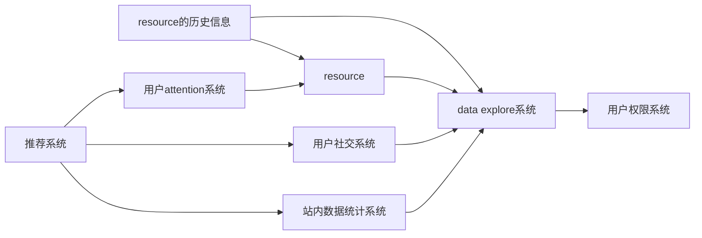

# THCDB 开发路线图

本文档说明项目发展路线的阶段及其对应的功能。

---
**功能树**:
- [已开发功能](#已开发功能)
  - [Artist](./resource/artist/design.md)
  - [Release](./resource/release/design.md)
  - [Song](./resource/song/design.md)
  - [Event](./resource/event/design.md)
  - [Label](./resource/label/design.md)
  - [Tag](./resource/tag/design.md)
  - [Credit Role](./resource/credit-role/design.md)
  - Song Lyrics
  - User
  - [examine and verify](./data_explore/examine_and_verify/design.md)
- [里程碑](#里程碑)
  - [核心功能](#核心功能)
    - [用户权限系统](./user/manager_permission/design.md)
    - [data explore系统](./data_explore/design.md)
  - [第一阶段：中心功能](#中心功能)
    - [用户attention系统](./architecture/user/information/attention)
    - [resource](./resource/design.md)
  - [第二阶段：边沿功能](#边沿功能)
    - [用户社交系统](./user/socialize/design.md)
  - [第三阶段：外延功能](#外延功能)
    - [站内数据统计系统](./statistics/design.md)
    - [推荐系统](./recommendation/design.md)
    - [resource的历史信息](./history-tracking/design.md)
- [依赖关系](#依赖关系)
---

## 已开发功能

| 模块 | 功能 | 架构 |
|------|------|------|
| Artist | 查询、创建、更新、图片上传 | 垂直切片 |
| Release | 查询、创建、更新、封面上传 | 垂直切片 |
| Song | 查询、创建、更新 | 垂直切片 |
| Event | 查询 | 垂直切片 |
| Label | 查询 | 垂直切片 |
| Tag | 查询、投票 | 垂直切片 |
| Credit Role | 查询 | 整洁架构 |
| Song Lyrics | 查询 | 整洁架构 |
| User | 注册、登录、登出、资料管理、角色/权限（基础） | 整洁架构 |
| examine and verify | 创建、查看、批准、拒绝、修订历史（列表） | 整洁架构 |

---
## 里程碑
---
### 核心功能
#### 用户权限系统
设计文档：[user-manger_permission](./user/manager_permission/design.md)
职能简述：
用户对于信息、用户等的操作、审核、管理等权限。

#### data explore系统
设计文档：[data_explore](./data_explore/design.md)
职能简述：
对信息、数据的增删查改、标记。

---
### 中心功能

#### 用户attention系统
设计文档：[user-information-attention](./user/information/attention/design.md)
职能简述：
用户的关注、歌单、收藏夹等数据。

#### resource
设计文档：[resource](./resource/design.md)
职能简述：
歌曲、艺术家、歌单等数据。

---
### 边沿功能

#### 用户社交系统
设计文档：[user-socialize](./user/socialize/design.md)
职能简述：
歌曲评论、私信、动态等。

---
### 外延功能

#### 站内数据统计系统

#### 推荐系统

#### resource的历史信息

---
## 依赖关系

