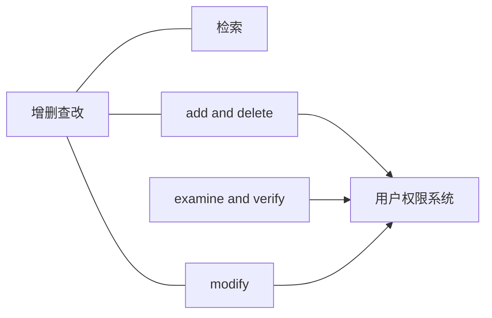
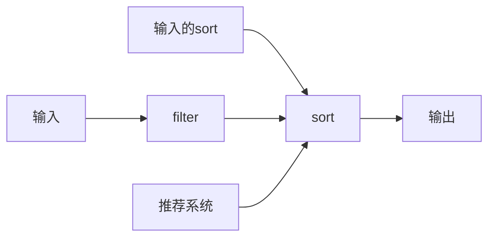
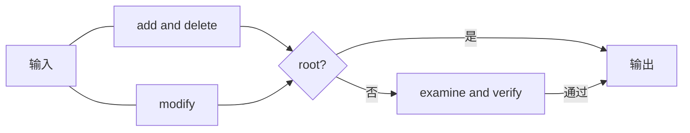

# data explore系统
该系统作为基础设施，随项目发展*add(增加)*功能。

---
## 职能
对信息、数据进行**增删查改**，对这些操作进行审核。
- [检索](./search/design.md)
- [add and delete](#add-and-delete)
- [modify](./modify/design.md)
- [examine and verify](./examine_and_verify/design.md)

**依赖**：

---

## 检索
设计文档：[search](./search/design.md)
对数据、信息进行搜索和综合。
权限要求：无
工作流（简化）如下图

---

## add and delete
增加**不存在的object**或删去**已存在的object**。
权限要求：**DataManager**或**root**
### 工作流程
如果delete的对象不存在，则返回一个值，记录Warning等级日志，执行情况为"failure! delete "{对象}" did not exist".
执行add操作前：
1. 检查字段是否符合对应类型的结构，如果不符合，则返回一个值。记录Warning等级日志，执行情况为"failure! "{字段}" is illegal data".
2. 如果add的对象存在，则不执行，并返回一个值，记录Warning等级日志，执行情况为"failure! "{对象}" did exist".
3. 如果符合对应类型结构且add的对象不存在，则执行.
执行add操作时，分配一个RFC4122 uuid v4给予object.
add/delete执行成功记录INFO等级日志，执行情况为"success, {add/delete} {对象} {uuid}".

---

## modify
修改**已存在的object**的数据片段。
权限要求：**User**或**root**
### 工作流程
如果modify的对象不存在，则返回值，记录Warning等级日志，执行情况为"failure! "{对象}" did not exist".
如果modify的object类型不存在请求的表键，则返回值，记录Warning等级日志，执行情况为"failure! "{对象}" did not have "{表键}"".
如果modify的对象存在且object类型请求的表键存在，则执行.
执行完记录INFO等级日志，执行情况为"success, {对象}:{表键} "{旧值}"->"{新值}"".

---

## examine and verify
设计文档：[examine_and_verify](./examine_and_verify/design.md)
对提交的对于某个object的modify的请求的审核。
**流程**：
