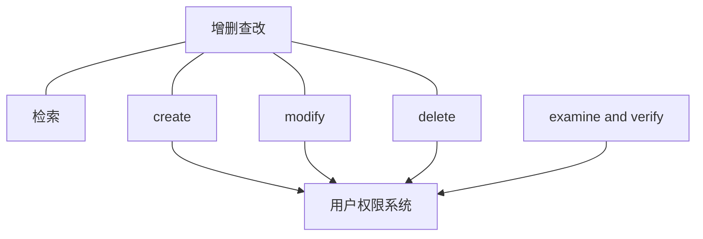
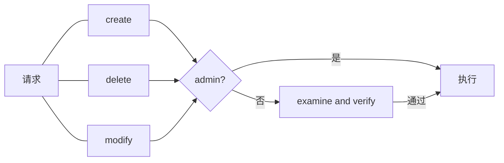

# data management系统
该系统作为基础设施，对resource进行管理.

---
## 职能
对信息、数据进行**增删查改**，对这些操作进行审核。
- [检索](./search/design.md)
- [create](#create)
- [delete](#delete)
- [modify](#modify)
- [examine and verify](./examine_and_verify/design.md)

**依赖**：

对同一对象的操作，delete优先级最高，检索优先级最低。

---

## 检索
设计文档：[search](./search/design.md)
对数据、信息进行搜索和综合。
权限要求：无
工作流（简化）如下图：

## create
新建**不存在的resource**.
接收一个数组，元素为键值对，包含以下内容：
- 类型.
键名为`type`，键值为resource中的任一类型.
- 数据.
键名为`data`，键值类型为数组，数组元素类型为键值对.

### 参数规范
`type`必须为已有的resource类型.
`data`的键值的元素，键值对的键名必须为`type`类型resource的键.
### 日志记录
执行结束记录INFO等级日志，执行情况为`success, new {type} resource with {UUID}`.
### 错误处理
- 如果`type`不是resource类型中的一种，则返回`unknown_type`.
- 如果`data`中的数组元素的键名存在`type`对应resource类型没有的键，则返回`unknown_key`.

## delete
删除**已存在的resource**.
接收一个`UUID`.

### 参数规范
`UUID`必须为已有的resource对象的UUID.
### 日志记录
执行结束记录INFO等级日志，执行情况为`success, delete {UUID}`.
### 错误处理
如果`UUID`没有对应的resource对象，则返回`unknown_resource`.

## modify
修改**已存在的resource**的数据片段.
接收一个数组，元素为键值对，包含以下内容：
- UUID.
键名为`UUID`，键值为字符串.
- 修改内容.
键名为`modify_data`，键值为数组，数组元素类型为键值对.

### 参数规范
`UUID`必须为已有的resource对象的UUID.
`modify_data`的键值的元素，键值对的键名必须为`UUID`对应的对象含有的键.
### 日志记录
执行结束记录INFO等级日志，执行情况为`success, modify {UUID} fields: {键名列表}`.
### 错误处理
- 如果`UUID`没有对应的resource对象，则返回`unknown_resource`.
- 如果`modify_data`中的数组元素的键名存在`UUID`对应resource对象的类型没有的键，则返回`unknown_key`.

## examine and verify
设计文档：[examine_and_verify](./examine_and_verify/design.md)
对提交的对于某个resource的请求的审核，可以传入一连串请求，作为单次请求.
**流程**：
