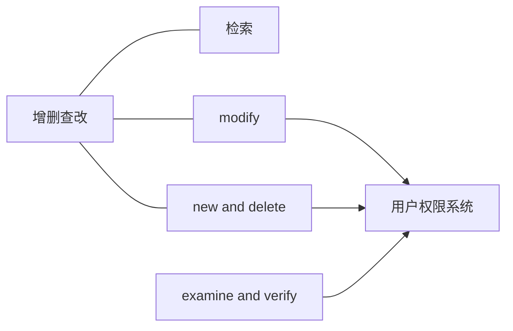
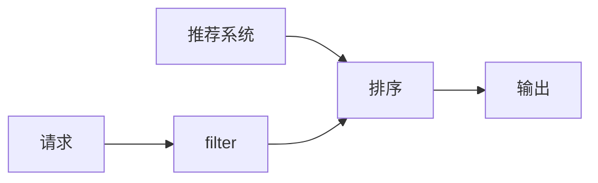
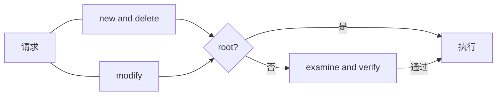

# data management系统
该系统作为基础设施，随项目发展**add**功能。

---
## 职能
对信息、数据进行**增删查改**，对这些操作进行审核。
- [检索](./search/design.md)
- [new and delete](#new-and-delete)
- [modify](./modify/design.md)
- [examine and verify](./examine_and_verify/design.md)

**依赖**：

对同一对象的操作，delete优先级最高，检索优先级最低。

---

## 检索
设计文档：[search](./search/design.md)
对数据、信息进行搜索和综合。
权限要求：无
工作流（简化）如下图

---

## new and delete
增加**不存在的object**或删去**已存在的object**，任何请求都需要经过examine_and_verify。
权限要求：
- 请求：**data manager**.
- 操作：**root**.
### 工作流程
对于new：
- 如果对象存在，则
    1. 记录Warning等级日志.
    2. 返回给调用者.
- 如果传入的字段与传入的object类型的字段格式不符，则
    1. 记录Warning等级日志.
    2. 返回给调用者.
- 如果对象不存在且传入的字段与传入的object类型的字段格式相符，则
    1. 分配一个RFC4122 UUID v4作为这个字段的UUID.
    2. 存入对应object类型的表.
    3. 记录INFO等级日志.
    4. 返回字段的UUID.

对于delete：
- 如果delete的对象不存在，则
    1. 记录Warning等级日志.
    2. 返回给调用者.
- 如果delete的对象存在，则
    1. 删除表中UUID所对应的行.
    2. 记录INFO等级日志.
    3. 返回给调用者.

只对外暴露创建请求接口，当创建请求的用户为root时，直接执行操作.

---

## modify
修改**已存在的object**的数据片段，任何请求都需要经过examine_and_verify。
权限要求：
- 请求：**object_rectify**.
- 操作：**root**.
### 工作流程
如果modify的对象不存在，则返回值，记录Warning等级日志，执行情况为"failure! "{对象}" did not exist".
如果modify的object类型不存在请求的表键，则返回值，记录Warning等级日志，执行情况为"failure! "{对象}" did not have "{表键}"".
如果modify的对象存在且object类型请求的表键存在，则执行.
执行完记录INFO等级日志，执行情况为"success, {对象}:{表键} "{旧值}"->"{新值}"".

---

## examine and verify
设计文档：[examine_and_verify](./examine_and_verify/design.md)
对提交的对于某个object的modify的请求的审核。
**流程**：
