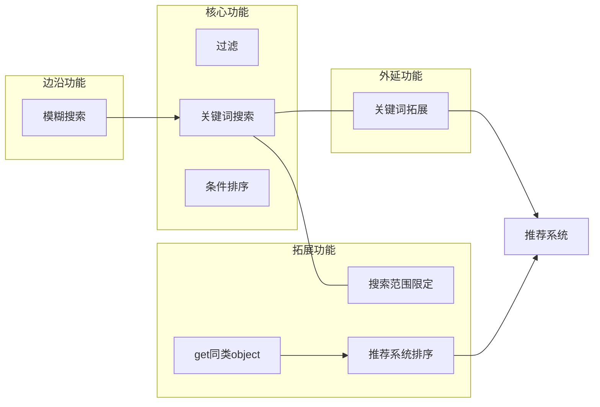
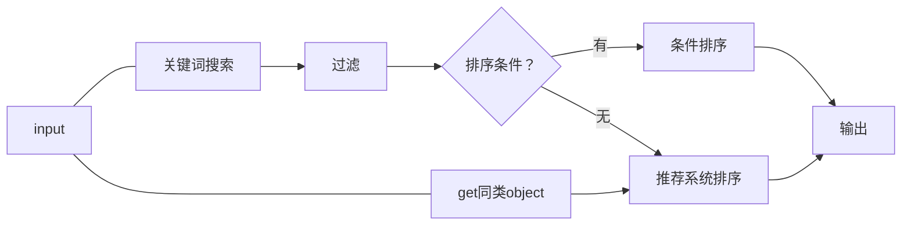

# Search (检索) 模块

该系统分阶段进行制造，该模块可与推荐系统配合.
不支持使用UUID检索，应直接请求对应UUID的数据.

---
## 阶段
- [核心功能](#核心功能)
- [拓展功能](#拓展功能)
- [边沿功能](#边沿功能)
- [外延功能](#外延功能)

**依赖**：

**工作流**：

---

## 核心功能
### 关键词搜索
对关键词搜索，对object的名字、简介等文本进行搜索，不包括时长、tag、history等.
### 过滤
仅满足过滤条件的进入下一步.
过滤条件包括Tag、发布时期、地区、object类型等.
### 条件排序
对一些object的单个字段进行排序，根据object类型有所变化.
与推荐系统排序互斥  ，两者仅可选其一.

## 拓展功能
### 搜索范围限定
拓展自：[关键词搜索](#关键词搜索)
限定关键词搜索的object的键.
### get同类object
复用：[推荐系统排序](#推荐系统排序)
获取同一类别的object，并进行排序，复用核心功能中的排序模块实现.
### 推荐系统排序
配合推荐系统，通过用户的推荐数据对过滤后的结果进行排序.
与条件排序互斥，两者仅可选其一.

## 边沿功能
### 模糊搜索
拓展自：[关键词搜索](#关键词搜索)
通过人工制作的近似字典和简单错拼算法进行搜索，前者解决语义相似，后者解决错误拼写.

## 外延功能
### 关键词拓展
基础：[推荐系统](../../recommendation/design.md)
拓展自：[关键词搜索](#关键词搜索)
配合推荐系统，通过用户推荐数据猜测可能的选词.

---

## 接口参数
- 请求大小、页数、上一次的最后一条的UUID.
大小为3的数组，元素均为键值对.
    - 键名为`size`，值为整数值类型，最小为1，最大为256.
    - 键名为`page_number`，值为整数类型.
    - 键名为`end_UUID`，值为字符串类型.
- 关键词.
用于关键词搜索，禁止非法字符.传入空值则返回整表经过排序的`请求大小`位.
- object类型.
类型为数组，至少提供一个元素，元素只能是object的类型之一.用于限定搜索的表.
- 过滤条件.
类型为键值对，可以为空，禁止不存在的键.
- 排序条件.
为空则则使用推荐系统排序（如果有实现）.
## 返回值
返回一个有序数组，数组元素为符合条件的对象的UUID.
### 错误处理
如果有非法参数，则返回`illegal_value`，日志记录Warning等级日志，动作执行情况为`{参数名}:{参数值} is illegal value!`.
如果`关键词`为空，且推荐系统未实现，则返回`search_unhandled_request`.
如果`object类型`为空，则返回`unrestricted_type`.
如果`过滤条件`的键不是`object类型`对应的类型中的任何一个键，则返回`inexistence_of_filter_key_in_request_type`.