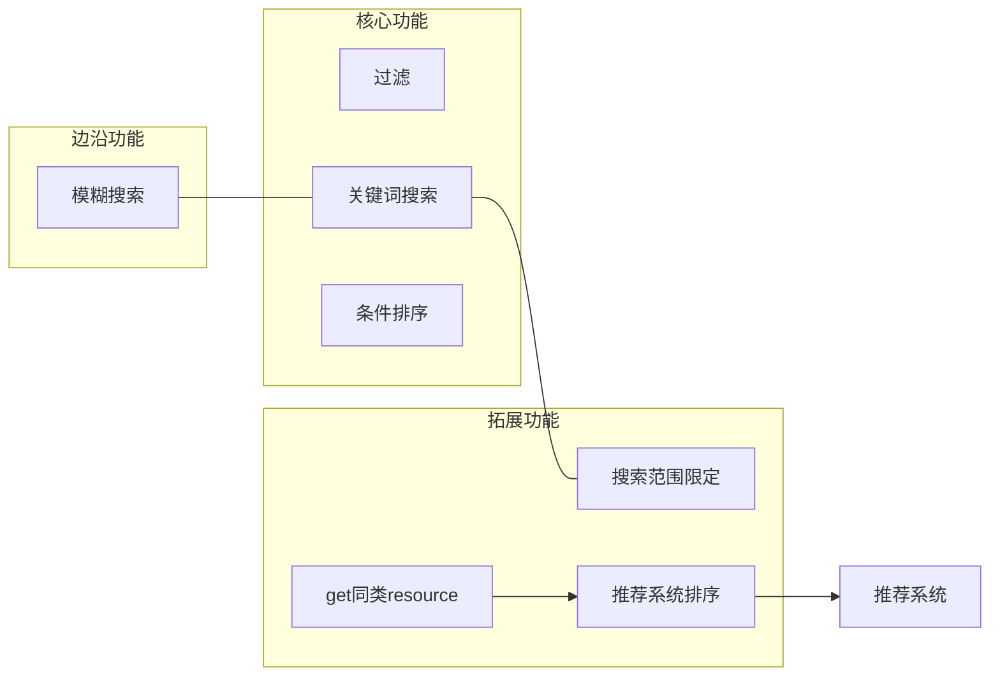
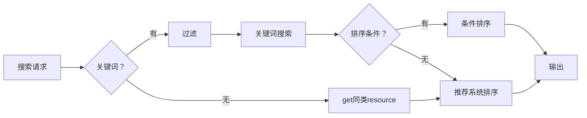

# Search (检索) 模块

该系统分阶段进行制造，该模块可与推荐系统配合.
不支持使用UUID检索，应直接请求对应UUID的数据.
接收两个字符串和一个数组，内容如下：
- 关键词.
类型为字符串.
- 过滤.
类型为数组.
- 排序.
类型为字符串.

---
## 阶段
- [核心功能](#核心功能)
- [拓展功能](#拓展功能)
- [边沿功能](#边沿功能)

**依赖**：

**工作流**：

---

## 核心功能
### 关键词搜索
返回含有`关键词`的resource，范围不包括时长、tag等.
### 过滤
返回含有`过滤`的所有元素的resource，范围包括Tag、发布时期、地区、resource类型.
### 条件排序
根据resource的单个字段进行排序，可选的字段和resource类型有关.
与推荐系统排序互斥，两者仅可选其一.

## 拓展功能
### 搜索范围限定
拓展自：[关键词搜索](#关键词搜索)
限定关键词搜索的resource的键.
### get同类resource
复用：[推荐系统排序](#推荐系统排序)
获取同一类别的resource，并进行排序，排序使用`推荐系统排序`.
### 推荐系统排序
配合推荐系统，通过用户的推荐数据对过滤后的结果进行排序.
与条件排序互斥，两者仅可选其一.

## 边沿功能
### 模糊搜索
拓展自：[关键词搜索](#关键词搜索)
通过人工制作的近似字典和简单错拼算法进行搜索，前者解决语义相似，后者解决错误拼写.

---

## 错误处理
如果有非法参数，则返回`illegal_value`，日志记录Warning等级日志，动作执行情况为`{参数名}:{参数值} is illegal value!`.
如果`关键词`为空，且推荐系统未实现，则返回`search_unhandled_request`.