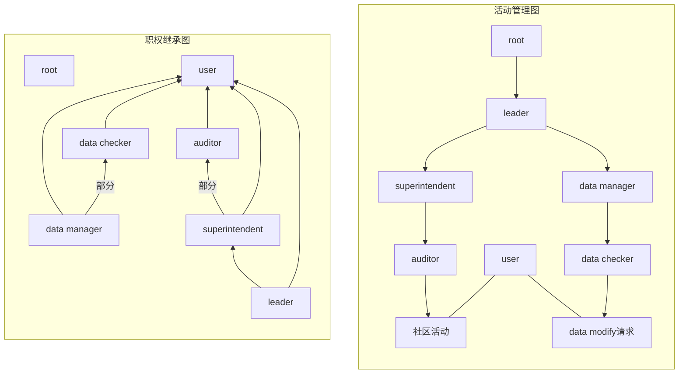

# User权限系统

---
## 权限类别
- [root](#root)
- [user](#user)
- [leader](#leader)
- 社区管理
    - [auditor](#auditor)
    - [superintendent](#superintendent)
- 信息
    - [data checker](#data-checker)
    - [data manager](#data-manager)

职权图：

---

## root
最高权限，**无视examine and verify**，无法清除日志，操作依然被日志记录.
无法直接运行汇编语言、机器语言、高级语言.
只能在数据库中手动标记授予.
不应可以登录，只可在后台进行调用，对user账户不开放.

## user
所有账户的基础权限.
能力：
- 评论、发布动态、设置个人资料等.
- 个性化设置、创建个人歌单、参与内测等.
- 可以获得任意权限，root权限无法直接或间接的获得.
- 发出关于data的modify请求.

## leader
授予或卸下user账户除root和leader以外的任何权限.
本身由root账户授予，并且是user账户.
具有superintendent权限.

## auditor
auditor黑名单的user的账户无法获取该权限，有权限的自动卸下权限.
职能：
- 对 *评论、动态、用户主页等* 与社交直接相关的信息进行审核，通过compliance audit系统.
- 可以对user进行时长不大于一个月的封禁或对某项社交功能的时长不大于三个月的禁止.
- 没有examine and verify的权限.

## superintendent
职责：对*所有社区活动*进行管理并负责.
能力：
- 授予或卸下user账户的auditor权限.
- 封禁user权限的账户.
- 将某个auditor权限的账户加入auditor黑名单.
- 具有auditor的审核权限.

## data checker
data checker黑名单的user无法获取该权限.
职能：
- 对数据进行审查核实，通过examine and verify系统.
- 没有compliance audit权限.

## data manager
职责：对*所有object的数据*进行管理并负责.
能力：
- 授予或卸下user账户的data checker权限.
- 将某个user加入data checker黑名单.
- 具有data checker的审查权限.
- 对数据进行组织、迁移.