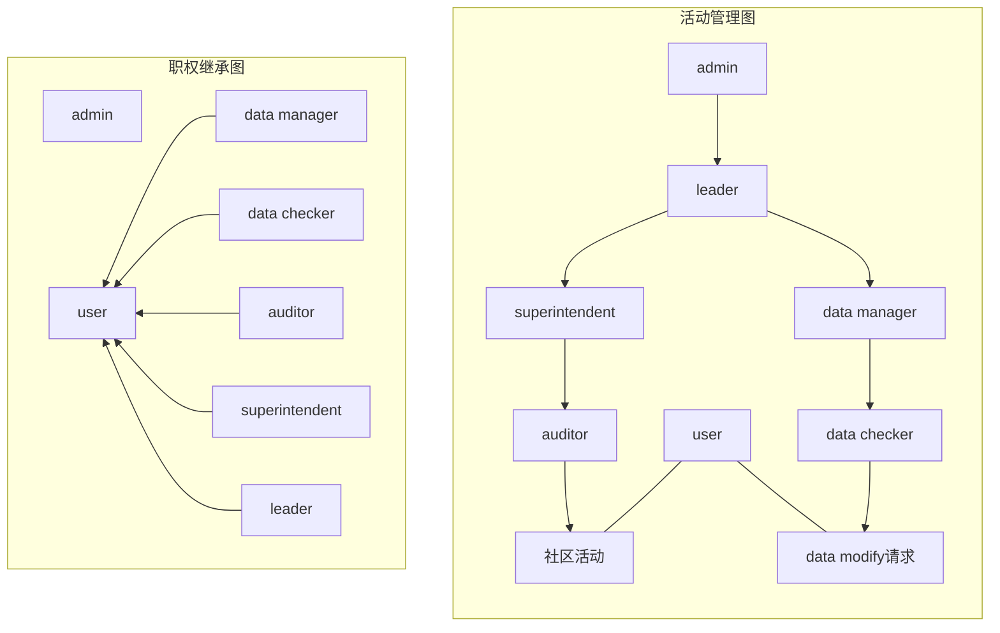

# User权限系统

---
## 权限类别
- [admin](#admin)
- [user](#user)
- [leader](#leader)
- 社区管理
    - [auditor](#auditor)
    - [superintendent](#superintendent)
- 信息
    - [data checker](#data-checker)
    - [data manager](#data-manager)

---

## admin
应用层最高权限，**无视`examine and verify`**.
- 所有操作依然通过API执行.
- 不应可以登录，只可在服务器终端登录，对user账户不开放.

## user
所有账户的基础权限，本质上是一组权限.
能力：
- `comment`：发布评论的权限.
- `gain_permission`：获得管理权限的权限.
- `resource_rectify`：发出关于某个resource的修正请求.
- `create_personal_list`：创建个人列表，包括收藏夹、歌单等.

## leader
本身由`admin`账户授予，并且是`user`账户.
原则上只有一位.
职责：对整个网站内容负责，对所有用户进行管理.
能力：
- 授予或卸下`user`账户`auditor`,`superintendent`,`data checker`,`data manager`权限.
- 封禁某个`user`账户的`gain_permission`.

## auditor
`auditor黑名单`的`user`的账户无法获取该权限.
如果在`auditor黑名单`且拥有该权限的则卸下权限.
职能：
- 对 *评论、用户主页等* 与社交直接相关的信息进行审核，通过compliance audit系统.
- 可以对`user`进行时长不大于一个月的封禁或对某项社交功能的时长不大于三个月的禁止.
- 没有`examine and verify`的权限.

## superintendent
职责：对*所有社区活动*进行管理并负责.
能力：
- 授予或卸下`user`账户的`auditor`权限.
- 封禁`user`权限的账户.
- 将某个`auditor`权限的账户加入`auditor黑名单`.
- 解除封禁某个账户的`gain_permission`权限.

## data checker
`data checker黑名单`的`user`无法获取该权限.
如果在`data checker黑名单`且拥有该权限的则卸下权限.
职能：
- 对数据进行审查核实，通过`examine and verify`系统.
- 没有`compliance audit`权限.

## data manager
职责：对*所有resource的数据*进行管理并负责.
能力：
- 授予或卸下user账户的`data checker`权限.
- 将某个`user`加入`data checker黑名单`.
- 封禁或解封某个`user`的`resource_rectify`权限.
- 对数据进行组织、迁移.
- 解除封禁某个账户的`gain_permission`权限.